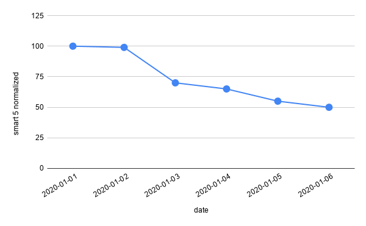
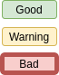
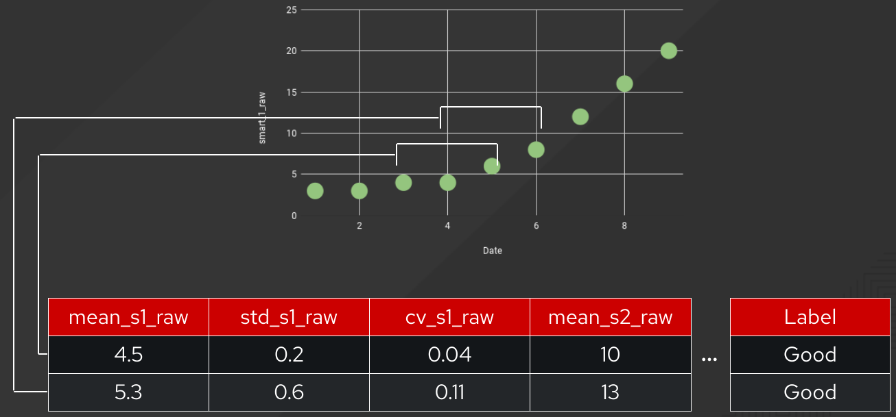

_Authors:_  Karan Chauhan (kachau@redhat.com), Michael Clifford (mcliffor@redhat.com)

_Date Created:_ 11 December 2020

_Date Updated:_ 17 December 2020

_Tags:_ supervised learning, time series, classification, ceph

## Abstract

Many large-scale distributed storage systems, such as Ceph, use mirroring or erasure-coded redundancy to provide fault tolerance. Because of this, scaling storage up can potentially be resource-intensive. In this project we aim to mitigate this issue using machine learning. Our goal is to build an ML model to predict if a hard drive will fail within a predefined future time interval. These predictions can then be used by Ceph (or other similar systems) to create or destroy replicas accordingly, thus making it more resource efficient. The open source models we built outperformed the ProphetStor model currently used as default in Ceph. Additionally, we framed the problem in a Kaggle kernel format to catalyze community participation in this task.

## Introduction

More than a million terabytes of data gets generated every day, and every bit of it is valuable. That’s why modern storage systems need to be reliable, scalable, and efficient. To provide fault tolerance and system availability, Ceph uses policy based data replication. It tries to store replicas on hard disks whose failure is likely not correlated, based on heuristics like physical proximity, shared power sources, and shared networks[1].

However, we want to go beyond heuristics for determining failure. The probability of data loss is proportional to the probability of multiple concurrent device failures. So if we could accurately anticipate failure and add additional redundancy in the system before it occurs, we could increase data durability by up to an order of magnitude. Thus, our goal in this project is to build machine learning models to predict when a hard drive would fail.

## Data

Using the right data is critical for creating meaningful models. With that in mind, we used SMART metrics collected from hard drives as our training data. SMART is a monitoring system that reports various indicators of drive reliability such as read error rate, uncorrectable sector count, etc[2]. We used the SMART metrics dataset that Backblaze has curated and made publicly available[3]. In addition to SMART metrics, this dataset also contains labels that specify whether or not a drive failed on a given date. Having these labels is incredibly powerful as it opens the door for training supervised machine learning models.

| date       | serial no. | smart 1 raw | smart 1 normalized | ... | smart 250 normalized | failure |
| ---------- | ---------- | ----------- | ------------------ | --- | -------------------- | ------- |
| 2020-01-01 | hdd1234    | 10          | 100                | ... | 100                  | 0       |
| 2020-01-01 | hdd5678    | 12          | 99                 | ... | 100                  | 0       |
| 2020-01-02 | hdd1234    | 23          | 70                 | ... | 80                   | 1       |
| 2020-01-02 | hdd5678    | 13          | 100                | ... | 99                   | 0       |

Table 1: Illustrative rendition of the Backblaze dataset

## Methodology

Previous work done in this domain seemed to suggest that SMART metric behavior may vary across drive vendors. Also, only a handful of vendors collectively make up the majority of drives being used. For these two reasons, we decided to train one prediction model per vendor.

The first step in the training pipeline was to clean the data. We will omit explanations for the data cleaning methods we used, but curious readers can check it out here[4]. Next, to determine which metrics to use as input features, we looked at the correlations of each metric with failure, and also referred to previous research done.

Then, to determine what kind of models to build, we focused our attention to the fact that these models are intended to be first-class citizens in Ceph. So we needed to be mindful of any constraints involved with upstream integration. Ceph already had a health prediction module[5] that consumed 6-12 days of SMART metrics and used ProphetStor’s sample model[6] to estimate drive health as "bad" (fail in 2 weeks), “warning” (fail in 2-6 weeks), or “good” (fail in >6 weeks). With this, our requirements boiled down to the following

1. Model output should be “good”, “warning”, or “bad”
2. At most 6 days of data can be _guaranteed_ to be available at run time

Figure 1: Sample model input (only one SMART metric shown)

Figure 2: Sample model output

Considering all these facts, we decided that building multiclass time series classification models was the way to go. Our approach for training models can be summarized as follows: for each 6-day sliding window, create a feature vector characterizing the multidimensional time series, and then feed this feature vector to a classification model. The label for each sliding window would be good/warning/bad based on how many days away from failure the drive was on the 6th (i.e. most recent) day.

Figure 3: Creating feature vectors from each sliding window

## Results

To evaluate models, we first created train and test sets. We ensured that data in these two sets was from completely different drives, so that there is no “leakage” across the two sets. We trained and evaluated a few classical models such as decision trees, GBDTs, random forest, etc[7]. Note that to ensure ease in downstream packaging, we limited ourselves to use only the python packages available in EPEL. Under this constraint, we found that a random forest classifier performed the best, and outperformed the SVM based sample model currently used as default on Ceph. Specifically, the results were as follows

[.center]
|===
| Model       | Good        | Warning     | Bad
| ProphetStor | *0.998*     | 0.000       | *0.003*
| Red Hat     | 0.971       | *0.001*       | 0.002
|===
Table 2a: Recall score on each class for two models

[.center]
|===
| Model       | Good        | Warning     | Bad
| ProphetStor | 0.489       | 0.000       | 0.266
| Red Hat     | *0.489*     | *0.310*     | *0.333*
|===
Table 2b: Precision score on each class for two models

## Conclusion

In this blog we discussed an important practical use case of data science in the operations domain. Specifically we described how we used machine learning to predict hard drive failure for Ceph, to make it more efficient. As seen in Fig 3, the approach we used seems to outperform the sample ProphetStor model. Still, we believe there is a lot of room for improvement. This work is intended to serve a catalyst for community involvement. To drive that home, we have made the code available[8,9] and also created a short “getting started”[10] jupyter notebook similar to a Kaggle kernel. Please feel free to explore this problem in detail, and open issues or submit PRs on our repo. If you’re a Ceph user, you can also contribute in improving the models by providing real usage data from your Ceph clusters via telemetry[11].

## References

[1] [How Red Hat Ceph Storage clusters work](https://access.redhat.com/documentation/en-us/red_hat_amq/7.5/html/configuring_amq_broker/configuring-fault-tolerant-system-configuring#about-ceph-storage-clusters-configuring)

[2] [S.M.A.R.T](https://en.wikipedia.org/wiki/S.M.A.R.T.)

[3] [Backblaze Dataset](https://www.backblaze.com/b2/hard-drive-test-data.html)

[4] [Data Cleaning Jupyter Notebook](https://github.com/aicoe-aiops/ceph_drive_failure/blob/master/notebooks/step2a_data_cleaner_seagate.ipynb)

[5] [Ceph diskprediction module](https://docs.ceph.com/en/latest/mgr/diskprediction/)

[6] [ProphetStor model](https://github.com/ceph/ceph/tree/master/src/pybind/mgr/diskprediction_local/models/prophetstor)

[7] [Classifier Models Exploratory Jupyter Notebook](https://github.com/chauhankaranraj/ceph_drive_failure/blob/master/notebooks/step3b_ternary_clf.ipynb)

[8] [GitHub repo](https://github.com/aicoe-aiops/ceph_drive_failure)

[9] [GitHub repo with Kaggle-like setup](https://github.com/AICoE/disk-failure-prediction)

[10] [Getting Started Jupyter Notebook](https://github.com/AICoE/disk-failure-prediction/blob/master/Getting_Started.ipynb)

[11] [Ceph Telemetry](https://docs.ceph.com/en/latest/mgr/telemetry/)

### Project Material

#### Steps to get you started:

1. Visit https://jupyterhub-opf-jupyterhub.apps.cnv.massopen.cloud/hub/login
2. Login with your google account
3. In this Spawn screen, select ceph-drive-failure:latest
4. Once your server starts, go into the directory named ceph-drive-failure-yyyy-mm-dd-hh-mm
5. Go to `notebooks`. You can either run the step-by-step notebooks one after the other, or run the end-to-end notebooks.

#### How to Contribute / Provide feedback

- Github Repository: https://github.com/aicoe-aiops/ceph_drive_failure
- You can open up a PR on the Git Repository highlighting the feature or issue, and we will address it.
- You can also reach out to kachau@redhat.com for any questions.